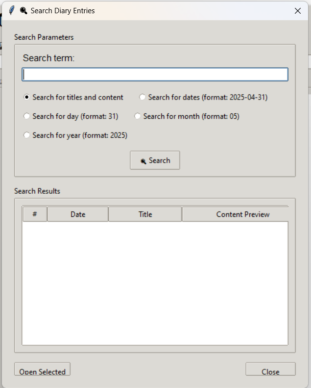

# 📔 Personal Diary App (Group 06)

A Python-based personal diary application with a Tkinter GUI.  
It allows users to register/login, add diary entries with a title and content, view entries, search by date or keyword, and manage data stored securely in JSON.

---

## ⚙️ Setup Instructions

### 1. Install Python
This project requires **Python 3.12**.  
- If you already have Python **3.12**, you’re good to go.  
- If you only have Python **3.10 or 3.11**, you must install **Python 3.12** from [Download Python 3.12](https://www.python.org/downloads/release/python-3120/)  

👉 **Note:**  
If multiple Python versions are installed on your system, you can run this project with:  
- Linux/Mac:
  ```bash
  python3.12 main.py
  ```
- Windows:
  ```bash
  py -3.12 main.py
  ```
👉   
Verify your Python version:
```bash
python --version
```

### 2. Clone the repository
```bash
git clone https://github.com/t3ch-spawn/group06-personal-diary-app.git
cd group06-personal-diary-app
```

### 3. Install Pipenv (if not already installed)
```bash
pip install pipenv
```

### 4. Install dependencies
```bash
pipenv install --dev
```

### 5. Activate the virtual environment
```bash
pipenv shell
```

---

## ▶️ Running the Application

Run the Tkinter-based diary UI (main entry point):
```bash
python main.py
```

---

## 🧪 Running Tests

Tests are located in the `tests/` folder.

Run all tests:
```bash
pytest
```

Or:
```bash
pipenv run pytest
```

Run a specific test file:
```bash
pytest tests/test_diary.py
```

---

## 📂 Project Structure
```
group06-personal-diary-app/
│── diary.py               # Backend logic for diary operations
│── storage.py             # Handles data storage in JSON
│── main.py    # Tkinter-based frontend (main entry point)
│── tests/                 # Unit tests for diary and storage
│── Pipfile                # Dependency management
│── Pipfile.lock           # Locked dependency versions
│── .github/workflows/     # GitHub Actions workflows for CI
│── README.md              # Project documentation
```

---

## 👥 Roles & Contributions
- **Christopher(kristovpsy), segun(oluwasegun-dev)[Developer - Frontend] – Frontend (Tkinter UI)**  
  Responsible for designing and implementing the user interface (`diary_UI_updated.py`), including input fields, login dialog boxes, calendar integration, search interface, view entries interface.  
  [See commit](https://github.com/t3ch-spawn/group06-personal-diary-app/commit/592801b9840b2fc7ea8b4226f8b5bae68d0db157)
  [See commit](https://github.com/t3ch-spawn/group06-personal-diary-app/pull/4/commits/aeac3b7d1f36c45c7f466907a66a40670516b736)

- **Fadilah(Fadilah1-hub)[Pytests / Tests] – Testing & Security**  
  Developed the Pytest test cases for the diary and storage modules, and implemented the security module for user authentication.
 [See commit](https://github.com/t3ch-spawn/group06-personal-diary-app/commit/6a8808727e23af3f09c17be74745b9baa72163c8)
  

- **Peter(perryblaq26)[Developer: Core Logic] – JSON Storage**  
  Implemented the JSON-based storage functionality for persisting diary entries.  
  [See commit](https://github.com/t3ch-spawn/group06-personal-diary-app/commit/1a4db48d94bc15c334d9e68a80b16f572e79ebc9)

- **Idris(OBALOLALUMIERE01)[Developer: Core Logic] – Entry Editing & Deletion**  
  Wrote the code for editing and deleting user diary entries.  
  [See commit](https://github.com/t3ch-spawn/group06-personal-diary-app/commit/64992105f955091f32d44b2d994b3cbbdfa18b40)

- **Kabir(kabirahmadmusa66-bot)[Developer: Core Logic] – Regex Search**  
  Implemented keyword-based search functionality using regular expressions.  
  [See commit](https://github.com/t3ch-spawn/group06-personal-diary-app/commit/b83e930d9a82873e3abca65d8f669c2f0db403bd)

- **Muhammad(muhnasmmad-glitch)[Developer: Core Logic] – Entry Creation**  
  Developed the functionality for creating new user diary entries.  
  [See commit](https://github.com/t3ch-spawn/group06-personal-diary-app/commit/e72cc802692ea7de26bb88c888eef72166fef384)

- **Bolu(t3ch-spawn)[Team Lead, Docs, Presenter] – Date Search & Codebase Integration**  
  Implemented search by date functionality, and was responsible for merging, organizing, and refining code across features (creating, editing, deleting, and searching entries).  
  Also enhanced the storage module and restructured the codebase to support multiple user flows.  
  Scheduled and facilitated meetings, ensured code consistency across the team, aided in team communication, and oversaw the repository to maintain overall project quality.  
  Additionally, set up the README documentation and served as the demo video presenter.
  [See commit](https://github.com/t3ch-spawn/group06-personal-diary-app/commit/9e660a80715764abf6d1cf57145b029860ac2db1)
  [See commit](https://github.com/t3ch-spawn/group06-personal-diary-app/commit/608a0d6dc8c61a2e8a2488c54220e00b90966b96)
  [See commit](https://github.com/t3ch-spawn/group06-personal-diary-app/commit/2ae15edf3594dc194873cf18d9b8baad3be43ca9)

> The commit history in this repository reflects each member’s contributions in line with the roles above.


---

## 🎥 Demo Video
[Video Link](https://drive.google.com/file/d/1N1ufF-kD6coiaLFF-oWhgFWz1FuZEqE0/view?usp=drive_link)

---

## 📸 Screenshots
## 🔐 1. Login or Register

When you open the app, you’re greeted with the **Login Dialog**.  
- If you already have an account, enter your username and password and click **Login**.  
- If you don’t have an account, click the **Register New User** button.  


---

### 🆕 Registering a New User

Clicking **Register New User** opens the **Register Dialog**.  
- Enter a username.  
- Enter a password and confirm it.  
- Once registered, you can log in using your new credentials.  


---

## 📔 2. Diary UI

After logging in, you’ll be greeted with the **Diary UI**.  
- The **title field** lets you enter the title of your diary entry.  
- The **content field** is where you write your diary note for the day.  
- Only one entry per day is allowed.  

On the **left side**, there’s a **calendar** where you can select a date.  
- Clicking on a date lets you view or add an entry for that day.  


---

## 💾 3. Saving an Entry

Once you’ve written your entry:  
- Click **Save** in the quick actions panel (bottom left, under the calendar).  
- Or press **Ctrl+S** to save quickly.  

If you want to **edit an entry**, simply modify the title or content and click **Save** again.


---

## 🗑️ 4. Deleting an Entry

To delete an entry:  
1. Select the date of the entry using the calendar.  
2. Click the **Delete** button in the quick actions panel.  


---

## 📋 5. Viewing All Entries

Click the **View All** button in the quick actions panel to open the **View All Entries Dialog**.  
- This dialog lists all entries, showing the **date, title, and content**.  
- Double-clicking an entry will take you directly to that entry in the Diary UI.  


---

## 🔍 6. Searching Entries

Click the **Search** button in the quick actions panel to open the **Search Dialog**.  
- You can search by **title or content** using keywords.  
- You can search by **date**, using the format `YYYY-MM-DD` (e.g., `2025-04-31`).  
- You can also search by **year** (e.g., `2025`), **month** (e.g., `05`), or **day** (e.g., `31`). 


